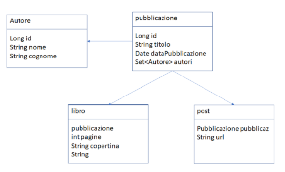

# publication

Publication is a spring boot project for studyng Spring boot feature, in particular

- Spring boot v. 2.4.3
- spring jpa
- lombok
- mapstruct
- spring web
- support sqlite
- support postgres
- support mySQL

## Course Description

In this course i show you how to implements rest services, in particular

- Connect to database
- sqlite
- mySql
- postgres
- Jpa Mapping
- Pagination and Sorting
- 1:1 Relationships
- 1:M Relationships
- M:M Many to Many relationships
- Transactions
- mapstruct and dto

## Database Supported

- MySQL
- SQLite
- PostgreSQL

## Data Model

The Publication data model represents a digital media store, including tables for book, author, publication

## How do I Download and Create the publication Database?

Download the repository, compile and launch in intellij or eclipse or visualstudio code.
After installation run the command

```
mvn clean install
java -jar .\target\jpachinook-0.0.1-SNAPSHOT.jar --server.port=8080 --spring.profiles.active=sqlite
```

## active profiles

- sqlite
- mysql
- postgres

An embedded database, SQLite and SQL Server Compact, it is also provided the embedded database in src/main/resourse/chinook.db

Notes:

## MySQL

- Tested with MySQL server comunity v. 8.0.0.1

## Postgres

- Tested with Postgres v 13.2

## SQLite

- Tested with SQLite 3.25.2

## Development

### System Requirements

- Intellij comunity edition
- Eclipse
- Visual Studio Code
- MySql V8.0.1
- Postgres v 13.2
- Sqlite v 3.25.2

## database: ER



## Install postman for Rest Services

import the collection in postman

[Publication.postman_collection](publication.postman_collection.json)

## License

[MIT](https://choosealicense.com/licenses/mit/)
